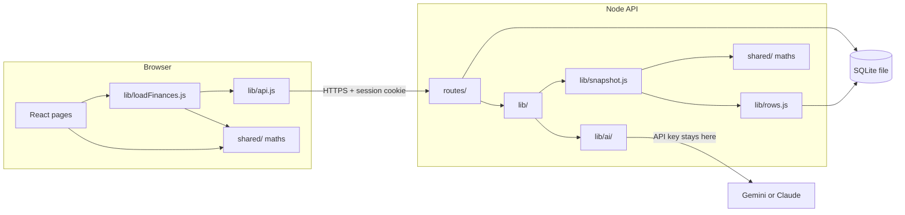
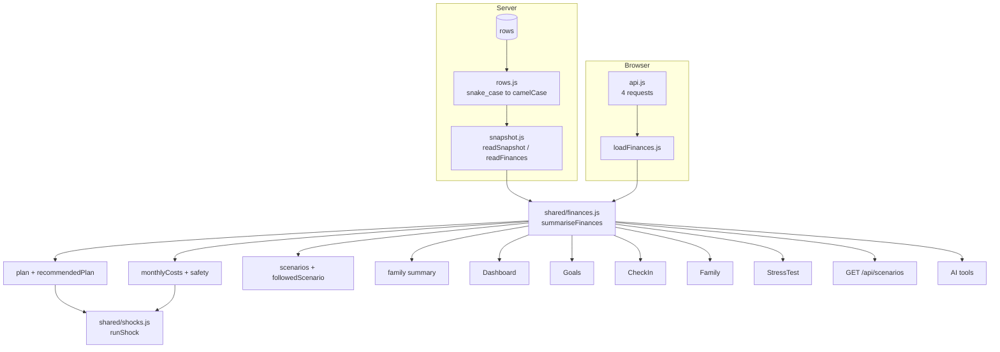
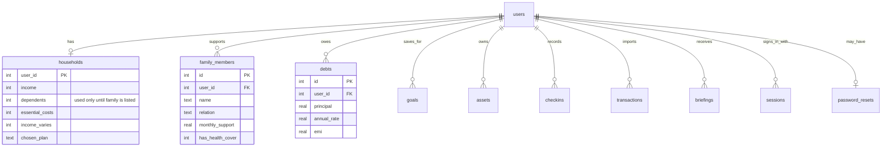
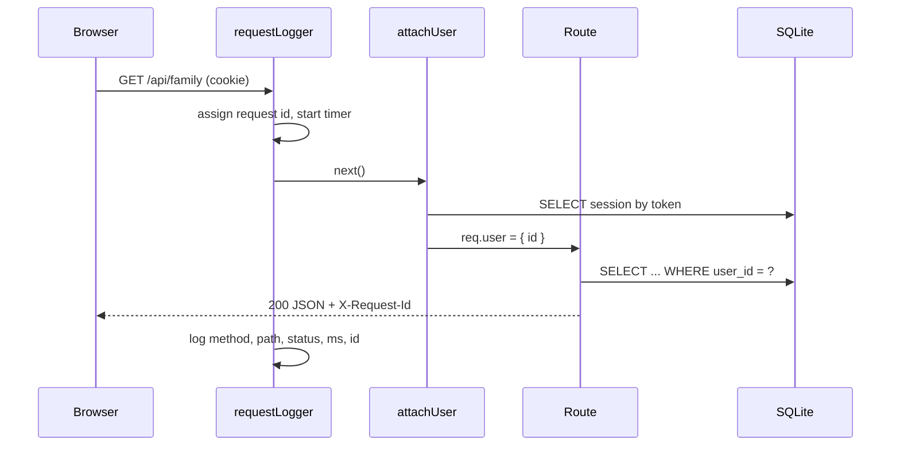

# Nest-Worth system design

Nest-Worth is a money planner for Indian households where one salary supports
several people. It builds a monthly plan from real family obligations, tests
that plan against bad events (a job loss, a hospital bill), and explains every
number in plain language, including through an AI coach.

This document describes how the system is built and why. For running it, see
`SETUP.md`. For finding a bug, see `docs/DEBUGGING.md`.

---

## 1. Requirements

### What it has to do

| Area | Requirement |
|---|---|
| Accounts | Sign up and sign in by email and password, phone code, or Google. Reset a forgotten password. Delete the account and all its data. |
| Household | Record income, rent and bills, and the family members the salary supports, each with a monthly amount and health cover. |
| Plan | Split what is left after fixed costs into spend, save and invest, and explain why. |
| Money records | Debts, goals, assets, monthly check-ins, and bank statements read from CSV. |
| Plans compared | Play several ways of using the same money forward fifteen years. |
| Stress test | Walk the cash forward a year through one shock and say when it runs out and what would fix it. |
| AI coach | Answer questions using the app's own calculations, never its own arithmetic. |

### Qualities that shape the design

1. **Every number must agree everywhere.** The dashboard, the goals page, the
   stress test and the AI coach must show the same plan for the same person.
   A money app that disagrees with itself cannot be trusted.
2. **One person's data is never visible to another.** Every query is scoped to
   the signed-in user.
3. **A bug should be easy to trace.** Each number has one function that
   produces it and one test file that checks it.
4. **Simple to run.** No database server, no message queue. Two `npm run dev`
   commands.

---

## 2. Architecture

`shared/` appears on both sides because it is the same folder. The browser
imports it for instant feedback (dragging a slider), and the server imports it
for the AI coach and the API. There is one copy of the money maths.

### Layers and what each one owns

| Layer | Folder | Owns | Must not |
|---|---|---|---|
| Pages | `frontend/src/pages/` | Layout, local state, user input | Build a plan itself. Call `loadFinances` and read `finances`. |
| Loader | `frontend/src/lib/loadFinances.js` | Fetching the four lists the plan needs | Hide a failed request behind an empty list |
| API client | `frontend/src/lib/api.js` | URLs, cookies, the `{ ok, data, error }` shape | Contain business rules |
| Money maths | `shared/` | Every calculation: plan, debts, goals, scenarios, stress test | Touch the database, the network or React |
| Routes | `backend/src/routes/` | HTTP: read the request, check it, send a status | Do maths beyond calling `shared/` |
| Services | `backend/src/lib/` | Sessions, validation, statements, AI loop, snapshots | Know about `req` or `res` |
| Row mapping | `backend/src/lib/rows.js` | Turning snake_case rows into app objects | Exist anywhere else |
| Schema | `backend/src/database/schema.sql` | Tables, keys, indexes | Be changed without a migration in `db.js` |

---

## 3. One source of truth for the numbers

This is the core design decision, and it fixed real bugs.

Before, five places built the plan: the dashboard, the goals page, the
check-in page, the scenarios route and the AI tools. They had drifted:

- The goals and check-in pages left out the debt's interest rate, so for a
  cheap home loan they showed a lower monthly saving than the dashboard.
- The goals page ignored the plan chosen on `/plans`.
- "One month of costs" left out rent and bills in four places, so the safety
  net looked longer than it really was.

Now there is one function, `summariseFinances` in `shared/finances.js`, and
every caller reaches it through one loader per side.

What `summariseFinances` returns:

| Field | Meaning |
|---|---|
| `recommendedPlan` | The split the model suggests |
| `plan` | What to show: the chosen plan if one was picked on `/plans`, otherwise the recommendation |
| `followedScenario` | The chosen plan, or `null` |
| `scenarios` | Every plan played out fifteen years |
| `monthlyCosts` | Rent and bills, family support, EMIs and everyday spending |
| `safety` | Months of cover against the target for this household |
| `family` | Total support, count, and who has no health cover |
| `dependents` | The number of family members listed, or the onboarding count if none |
| `debtSummary`, `netWorth` | Totals |

---

## 4. Data model

Rules every user-owned table follows. `backend/tests/database.test.js` checks
them against the live schema, so a new table that breaks one fails the tests:

1. `user_id` has `ON DELETE CASCADE`, so deleting an account deletes its rows.
2. A lookup by `user_id` uses an index.

Dates are stored as ISO text (`2026-09-14`), which sorts in date order.
Booleans are `INTEGER` 1 or 0. Money is `REAL` for debts, since EMIs can have
paise, and rounded to whole rupees before display.

---

## 5. Request lifecycle

- The user id always comes from the session, never from the URL or body.
- Every response carries `X-Request-Id`. A 500 also returns it in the body, so
  a bug report can name the exact log line.
- Errors thrown in a route reach one error handler in `app.js`, which logs the
  real error and sends a plain message.

---

## 6. The stress test model

`shared/shocks.js` walks cash forward month by month for twelve months.

| Month kind | Cash change |
|---|---|
| Normal | income − rent and bills − family support − EMI (including any extra from the chosen plan) − spending − investing |
| Crisis | shock income − rent and bills − family support − required EMI − spending × 50% − shock cost |

| Shock | What changes | Default |
|---|---|---|
| `job_loss` | Income is 0 | 4 months |
| `income_cut` | Income falls by a percentage | 30% for 6 months |
| `medical` | One bill in month 1, sent to the first family member without cover. With cover, 20% is paid out of pocket | ₹3,00,000 |
| `family_support` | Extra money each month | 20% of income for 6 months |

Verdicts: **breaks** if cash goes below zero, **tight** if the lowest point is
under one month of costs, **safe** otherwise. The reported shortfall is tested
to be enough: adding it to savings and re-running never breaks.

Every assumption is a named constant at the top of the file and is shown on the
page, so a user can see what the result depends on.

---

## 7. Decisions and trade-offs

| Decision | Chosen | Alternative | Why |
|---|---|---|---|
| Database | SQLite, one file | Postgres | No server to run. Every query is plain SQL, so moving to Postgres later is mostly a driver change. |
| Sessions | Random token in an `httpOnly` cookie, stored server side | JWT | A session can be revoked instantly, for example when a password changes. |
| Where maths runs | `shared/`, imported by both sides | Server only | The browser recalculates instantly on a slider. The server needs the same answers for the AI. One copy prevents drift. |
| Stress test | Deterministic month-by-month walk | Monte Carlo simulation | Easy to explain and test. The same input always gives the same answer. |
| AI | Model chooses tools; tools do the maths | Model answers directly | A language model states wrong numbers confidently. |
| Categories | Rules | AI per transaction | Instant, free and consistent across months. |
| Failed load | Show the error | Carry on with empty lists | An empty debts list draws a plan that looks right and is wrong. |

---

## 8. Testing strategy

| Level | Where | What it proves |
|---|---|---|
| Money maths | `backend/tests/finances.test.js`, `scenarios.test.js`, `frontend/tests/money.test.js` | Rules and conservation: money is never created or lost |
| AI tools | `backend/tests/tools.test.js` | Tools agree with the app and never reach another user's data |
| API | `backend/tests/api.test.js` | Routes, validation, ownership, cascade delete, over real HTTP |
| Schema | `backend/tests/database.test.js` | Every user table cascades and is indexed |
| Components | `frontend/tests/*.test.jsx` | Charts draw real numbers, forms send the right shape, pages render |
| Layout | `npm run shots` in `frontend/` | Three screen sizes, both themes, overflow and clipped text |
| CI | `.github/workflows/ci.yml` | All of the above on every push |

Regression tests are named `regression:` and describe the bug they stop.

---

## 9. Scaling path

The current design is right for thousands of users on one server. The changes
below are listed in the order they would be needed.

| When | Change |
|---|---|
| More than one server | Move rate limit counts from memory to Redis. Move SQLite to Postgres. |
| Daily briefings get slow | Generate them in a background job instead of on first dashboard load. |
| Real bank data | Replace CSV upload with India's Account Aggregator framework through a licensed partner. |
| Real SMS and email | Replace `deliver()` in `lib/otp.js` and `lib/passwordReset.js`. |

### For companies (planned)

The same product can be offered by employers as a benefit. The design keeps
individual data private:

- An `organisations` table and an `organisation_members` table linking users.
- Employees get the full product. The employer sees only aggregates, such as
  "31% of staff would run out of cash within two months of a job loss".
- An aggregate is shown only when at least 10 people are in the group, so no
  figure can be traced back to one person.
- Aggregates are computed in SQL from the same stress test results, never by
  exposing any user's rows.

---

## 10. Before launch

- **SEBI:** personalised investment advice for a fee needs Investment Adviser
  registration. The app stays educational and says so on every page.
- **DPDP Act 2023:** a consent screen, a privacy policy, data export and
  account deletion. Deletion already exists.
- **Deployment:** app and API on the same site, since the session cookie is
  `sameSite: 'lax'`. See `SETUP.md` section 8.
