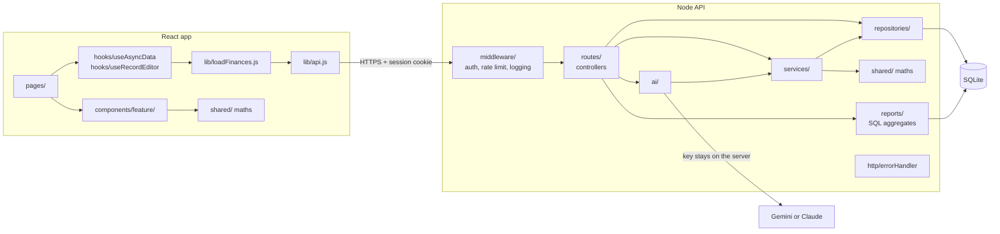
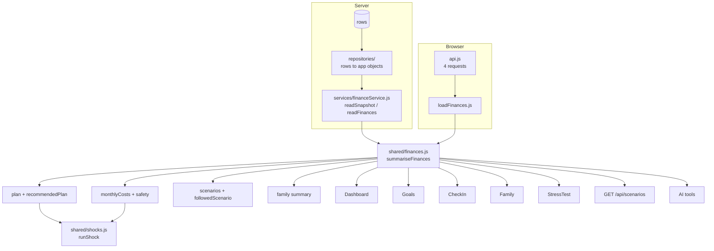
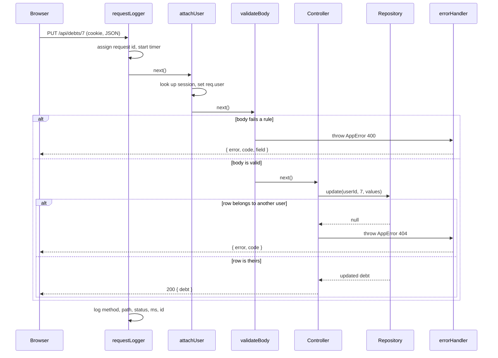

# Nest-Worth system design

Nest-Worth is a money planner for Indian households where one salary supports
several people. It builds a monthly plan from real family obligations, tests
that plan against bad events (a job loss, a hospital bill), and explains every
number in plain language, including through an AI coach.

This document describes how the system is built and why. For running it, see
`SETUP.md`. For finding a bug, see `docs/DEBUGGING.md`.

---

## 1. Requirements

### What it has to do

| Area | Requirement |
|---|---|
| Accounts | Sign up and sign in by email and password, phone code, or Google. Reset a forgotten password. Delete the account and all its data. |
| Household | Record income, rent and bills, and the family members the salary supports, each with a monthly amount and health cover. |
| Plan | Split what is left after fixed costs into spend, save and invest, and explain why. |
| Money records | Debts, goals, assets, monthly check-ins, and bank statements read from CSV. |
| Plans compared | Play several ways of using the same money forward fifteen years. |
| Stress test | Walk the cash forward a year through one shock and say when it runs out and what would fix it. |
| AI coach | Answer questions using the app's own calculations, never its own arithmetic. |

### Qualities that shape the design

1. **Every number must agree everywhere.** The dashboard, the goals page, the
   stress test and the AI coach must show the same plan for the same person.
   A money app that disagrees with itself cannot be trusted.
2. **One person's data is never visible to another.** Every query is scoped to
   the signed-in user.
3. **A bug should be easy to trace.** Each number has one function that
   produces it and one test file that checks it.
4. **Simple to run.** No database server, no message queue. Two `npm run dev`
   commands.

---

## 2. Architecture

`shared/` is one folder imported by both sides. The browser uses it for instant
feedback (dragging a slider), and the server uses it for the API and the AI
coach, so there is one copy of the money maths.

### Backend layers

A request passes through each layer in turn, and each layer has one job.

| Layer | Folder | Owns | Must not |
|---|---|---|---|
| Config | `config.js` | Every environment variable, read in one place | Be bypassed with `process.env` elsewhere |
| Middleware | `middleware/` | Request ids and logging, who is signed in, rate limits | Contain business rules |
| Controllers | `routes/` | Reading the request, validating it, calling a service or repository, sending the response | Contain SQL or maths |
| Validation | `validation/`, `http/validate.js` | Every rule a request body must meet | Touch the database |
| Services | `services/` | Business rules: signing in, sessions, codes, imports, finances | Know about `req`, `res` or SQL |
| Repositories | `repositories/` | All SQL for a table, and turning rows into app objects | Contain business rules |
| Reports | `reports/` | Read-only SQL aggregates: averages, running totals, the year recap | Write anything |
| AI | `ai/` | The prompt, the data snapshot, the agent loop, tools, providers | Do arithmetic or read the database directly |
| Errors | `http/errors.js`, `http/errorHandler.js` | One error type and one response shape | Leak stack traces to the browser |
| Schema | `database/` | Tables, keys, indexes, migrations | Change without a migration |

### Frontend layers

| Layer | Folder | Owns |
|---|---|---|
| Pages | `pages/` | Loading a page's data and arranging its sections |
| Feature components | `components/<feature>/` | The sections of one page: dashboard, debts, family, plans and so on |
| Shared UI | `components/shared/` | Card, Button, Notice, EmptyState, StatTile, PillGroup, RecordActions, form fields |
| Layout | `components/layout/` | The app shell, top bars, loading and error pages |
| Hooks | `hooks/` | Data loading and record editing state, reused by every page |
| Client | `lib/api.js` | URLs, cookies and the `{ ok, data, error }` result shape |
| Loaders | `lib/loadFinances.js` | Fetching everything the plan needs and building it once |

### Design patterns used, and why

| Pattern | Where | Why |
|---|---|---|
| Controller, service, repository | `routes/`, `services/`, `repositories/` | Each file has one reason to change, and a bug can be placed in one layer from its symptom. |
| Generic repository | `repositories/ownedRecordRepository.js` | Debts, goals, assets and family share list, create, update and delete. The rule "only this user's rows" is written once, so a new table cannot forget it. |
| Router factory | `routes/recordRoutes.js` | The four record APIs behave identically, and each route file is only its configuration. |
| Central error handling | `http/errors.js` | Code throws an `AppError`; one handler turns it into `{ error, code, field }`. No route formats its own errors. |
| Validation middleware | `http/validate.js` | Bodies are checked before a handler runs, so handlers can trust their input. |
| Configuration object | `config.js` | Settings are named and documented in one file instead of scattered string lookups. |
| Adapter | `ai/providers/` | Gemini and Claude each translate one neutral conversation shape, so the agent loop is written once. |
| Transaction script | `database/db.js` `inTransaction` | Multi-step writes (sign-up, password reset) apply fully or not at all. |
| Custom hooks | `hooks/useAsyncData.js`, `hooks/useRecordEditor.js` | Loading, stale-answer protection and add/edit/delete state are written once instead of in every page. |
| Composition | `components/shared/` | Pages are assembled from small components, so a visual change is made in one place. |
| Single source of truth | `shared/finances.js` | Every plan figure comes from one function, on both sides. |

---

## 3. One source of truth for the numbers

This is the core design decision, and it fixed real bugs.

Before, five places built the plan: the dashboard, the goals page, the
check-in page, the scenarios route and the AI tools. They had drifted:

- The goals and check-in pages left out the debt's interest rate, so for a
  cheap home loan they showed a lower monthly saving than the dashboard.
- The goals page ignored the plan chosen on `/plans`.
- "One month of costs" left out rent and bills in four places, so the safety
  net looked longer than it really was.

Now there is one function, `summariseFinances` in `shared/finances.js`, and
every caller reaches it through one loader per side.

What `summariseFinances` returns:

| Field | Meaning |
|---|---|
| `recommendedPlan` | The split the model suggests |
| `plan` | What to show: the chosen plan if one was picked on `/plans`, otherwise the recommendation |
| `followedScenario` | The chosen plan, or `null` |
| `scenarios` | Every plan played out fifteen years |
| `monthlyCosts` | Rent and bills, family support, EMIs and everyday spending |
| `safety` | Months of cover against the target for this household |
| `family` | Total support, count, and who has no health cover |
| `dependents` | The number of family members listed, or the onboarding count if none |
| `debtSummary`, `netWorth` | Totals |

---

## 4. Data model

Rules every user-owned table follows. `backend/tests/database.test.js` checks
them against the live schema, so a new table that breaks one fails the tests:

1. `user_id` has `ON DELETE CASCADE`, so deleting an account deletes its rows.
2. A lookup by `user_id` uses an index.

Dates are stored as ISO text (`2026-09-14`), which sorts in date order.
Booleans are `INTEGER` 1 or 0. Money is `REAL` for debts, since EMIs can have
paise, and rounded to whole rupees before display.

---

## 5. Request lifecycle

- The user id always comes from the session, never from the URL or body.
- Every response carries `X-Request-Id`. A 500 also returns it in the body, so
  a bug report can name the exact log line.
- Every error is an `AppError` thrown from wherever it happens and formatted by
  `http/errorHandler.js`. Anything else is a bug: it is logged with the request
  id and the browser gets a plain message. Malformed JSON is a 400, not a 500.

---

## 6. The stress test model

`shared/shocks.js` walks cash forward month by month for twelve months.

| Month kind | Cash change |
|---|---|
| Normal | income − rent and bills − family support − EMI (including any extra from the chosen plan) − spending − investing |
| Crisis | shock income − rent and bills − family support − required EMI − spending × 50% − shock cost |

| Shock | What changes | Default |
|---|---|---|
| `job_loss` | Income is 0 | 4 months |
| `income_cut` | Income falls by a percentage | 30% for 6 months |
| `medical` | One bill in month 1, sent to the first family member without cover. With cover, 20% is paid out of pocket | ₹3,00,000 |
| `family_support` | Extra money each month | 20% of income for 6 months |

Verdicts: **breaks** if cash goes below zero, **tight** if the lowest point is
under one month of costs, **safe** otherwise. The reported shortfall is tested
to be enough: adding it to savings and re-running never breaks.

Every assumption is a named constant at the top of the file and is shown on the
page, so a user can see what the result depends on.

---

## 7. Decisions and trade-offs

| Decision | Chosen | Alternative | Why |
|---|---|---|---|
| Database | SQLite, one file | Postgres | No server to run. Every query is plain SQL, so moving to Postgres later is mostly a driver change. |
| Sessions | Random token in an `httpOnly` cookie, stored server side | JWT | A session can be revoked instantly, for example when a password changes. |
| Where maths runs | `shared/`, imported by both sides | Server only | The browser recalculates instantly on a slider. The server needs the same answers for the AI. One copy prevents drift. |
| Stress test | Deterministic month-by-month walk | Monte Carlo simulation | Easy to explain and test. The same input always gives the same answer. |
| AI | Model chooses tools; tools do the maths | Model answers directly | A language model states wrong numbers confidently. |
| Categories | Rules | AI per transaction | Instant, free and consistent across months. |
| Failed load | Show the error | Carry on with empty lists | An empty debts list draws a plan that looks right and is wrong. |

---

## 8. Testing strategy

| Level | Where | What it proves |
|---|---|---|
| Money maths | `backend/tests/finances.test.js`, `scenarios.test.js`, `frontend/tests/money.test.js` | Rules and conservation: money is never created or lost |
| AI tools | `backend/tests/tools.test.js` | Tools agree with the app and never reach another user's data |
| API | `backend/tests/api.test.js` | Routes, validation, ownership, cascade delete, the error format, over real HTTP |
| Repositories | `backend/tests/repository.test.js` | The ownership rule and row mapping of the shared repository |
| Schema | `backend/tests/database.test.js` | Every user table cascades and is indexed |
| Hooks and UI | `frontend/tests/ui.test.jsx` | Data loading ignores stale answers; record editing adds, updates and keeps errors |
| Components and pages | `frontend/tests/*.test.jsx` | Charts draw real numbers, forms send the right shape, pages render |
| Layout | `npm run shots` in `frontend/` | Three screen sizes, both themes, overflow and clipped text |
| CI | `.github/workflows/ci.yml` | All of the above on every push |

Regression tests are named `regression:` and describe the bug they stop.

---

## 9. Scaling path

The current design is right for thousands of users on one server. The changes
below are listed in the order they would be needed.

| When | Change |
|---|---|
| More than one server | Move rate limit counts from memory to Redis. Move SQLite to Postgres. |
| Daily briefings get slow | Generate them in a background job instead of on first dashboard load. |
| Real bank data | Replace CSV upload with India's Account Aggregator framework through a licensed partner. |
| Real SMS and email | Replace `deliver()` in `services/otpService.js` and `services/passwordResetService.js`. |

### For companies (planned)

The same product can be offered by employers as a benefit. The design keeps
individual data private:

- An `organisations` table and an `organisation_members` table linking users.
- Employees get the full product. The employer sees only aggregates, such as
  "31% of staff would run out of cash within two months of a job loss".
- An aggregate is shown only when at least 10 people are in the group, so no
  figure can be traced back to one person.
- Aggregates are computed in SQL from the same stress test results, never by
  exposing any user's rows.

---

## 10. Before launch

- **SEBI:** personalised investment advice for a fee needs Investment Adviser
  registration. The app stays educational and says so on every page.
- **DPDP Act 2023:** a consent screen, a privacy policy, data export and
  account deletion. Deletion already exists.
- **Deployment:** app and API on the same site, since the session cookie is
  `sameSite: 'lax'`. See `SETUP.md` section 8.
